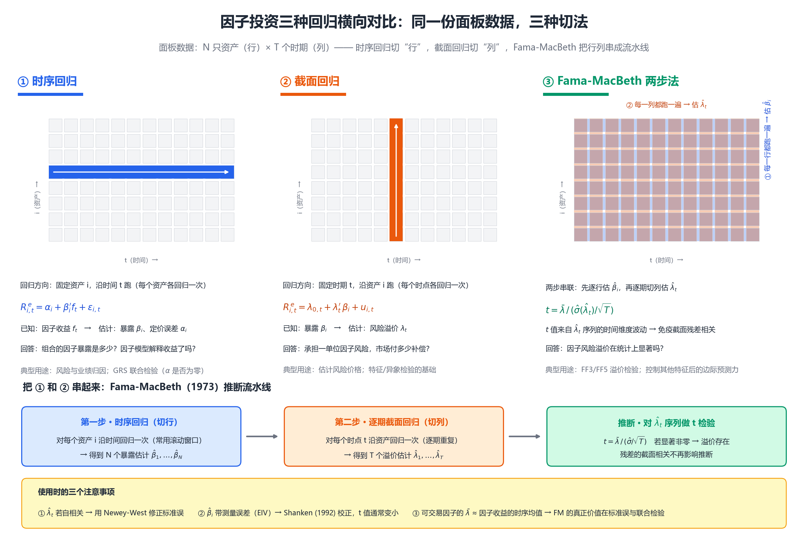

# 因子投资学习笔记（9月1日）：三种回归与公司特征

> **主题**：时序回归 / 截面回归 / Fama-MacBeth 两步法；公司特征（Characteristics）的原理
---

## 一、总览：三种回归回答三个不同的问题

| 方法 | 回归方向 | 已知量 | 估计的未知量 | 回答的问题 | 代表检验 |
|---|---|---|---|---|---|
| 时序回归 | 对**每个资产**，沿时间跑 | 因子收益 $f_t$ | 暴露 $\beta_i$、定价误差 $\alpha_i$ | 我的收益能被已知因子解释吗？ | GRS 联合检验 |
| 截面回归 | 对**每个时点**，沿资产跑 | 暴露 $\beta_i$ | 因子风险溢价 $\lambda_t$ | 承担一单位因子风险，补偿多少？ | 风险价格估计 |
| Fama-MacBeth | 先时序、后逐期截面 | — | $\bar{\lambda}$ 及其 t 统计量 | 因子溢价在统计上显著吗？ | FF3/FF5 溢价检验 |

**核心视觉隐喻**：同一份面板数据（行 = 资产 $i$，列 = 时间 $t$），三种"切法"——
时序回归切**一行**，截面回归切**一列**，Fama-MacBeth 把**所有行列**串成流水线。



---

## 二、时序回归（Time-Series Regression）

$$
R_{i,t}^{e} = \alpha_i + \beta_i^{\prime} f_t + \varepsilon_{i,t}, \qquad t = 1,\dots,T
$$

- **前提**：因子收益 $f_t$ 可观测（如 SMB、HML 这类可交易多空组合）。
- **产出**：暴露 $\beta_i$（收益结构 → 风险/业绩归因）、截距 $\alpha_i$（模型失效程度，联合检验用 GRS）。
- **直觉**："纵向"视角——盯一个资产，看它在时间轴上如何随因子起伏。

## 三、截面回归（Cross-Sectional Regression）

$$
R_{i,t}^{e} = \lambda_{0,t} + \lambda_t^{\prime}\, \beta_i + u_{i,t}, \qquad i = 1,\dots,N
$$

- **产出**：每期因子溢价 $\lambda_t$。
- **理论依据**：预期收益由风险暴露决定的关系体现在**横截面**上，而非时间序列上。
- **直接 OLS 的两个麻烦**：① 残差截面高度相关 → 标准误低估；② $\hat{\beta}_i$ 测量误差（EIV）→ 斜率稀释。

## 四、Fama-MacBeth（1973）两步法

```
第一步（时序，切行）：对每个资产 i 回归 → β̂₁,…,β̂_N（常用滚动窗口）
第二步（截面，切列）：每期 t 截面回归一次 → λ̂₁,…,λ̂_T
推断（t 检验）      ：t = mean(λ̂ₜ) / [ std(λ̂ₜ) / √T ]
```

**精髓在推断**：$t$ 值基于 $\hat{\lambda}_t$ 序列的**时间维度**波动，残差的**截面相关**已被各期估计值消化——这是它流行 50 年的根本原因。

**三个坑**：

| 坑 | 问题 | 对策 |
|---|---|---|
| 自相关 | $\hat{\lambda}_t$ 序列自相关，t 值虚高 | Newey-West |
| EIV | $\hat{\beta}_i$ 测量误差放大斜率方差 | Shanken (1992) 校正 |
| β vs 特征 | 现代实践直接用特征做截面回归 | 异象检测标准工具 |

## 五、两条实务流水线（方向相反）

| | 学术定价路线（FF3/FF5） | Barra 风险模型路线 |
|---|---|---|
| 已知 | 因子收益 | 因子暴露（行业哑变量、风格 z-score） |
| 未知 | $\beta_i$、$\alpha_i$ | 因子收益 $f_t$ 序列 |
| 顺序 | 时序回归 → FM 检验溢价 | 逐期截面回归估因子收益 → 时序分析估协方差 |

**深层联系**：可交易因子的 $\bar{\lambda}$ ≈ 因子时序均值收益 → FM 价值在标准误与联合检验；不可交易宏观因子才真正需要两步法。

## 六、公司特征的原理

- **一句话**：暴露（协方差）不可观测，特征**可观测、提前已知、可排序交易**——要么是风险暴露的代理，要么是错误定价的标记。
- **为什么替代 β**：β 估不准（EIV）、是"事后"的、不可预知；特征干净且可建仓。
- **两种解释**：风险代理论（FF 1992）vs 错误定价论（Daniel-Titman 1997）；调和：Kelly-Pruitt-Su (2019) IPCA "characteristics are covariances"。
- **三个角色**：排序标准（构造 HML/SMB）· 截面回归解释变量（异象挖掘）· 风险模型暴露（Barra）。
- **好特征标准**：经济逻辑 + t>3（Harvey-Liu-Zhu）· 慢变量低换手 · 无前视偏差（公告日对齐）· 横截面区分度 · 警惕拥挤衰减（McLean-Pontiff）。

---

## 七、一句话总结

> 定价理论说"收益 = 风险 × 价格"；时序回归求**风险**，截面回归求**价格**，Fama-MacBeth 让价格**可检验**；而公司特征是这一切的**操作入口**——把不可观测的协方差，翻译成可排序、可回测、可建仓的具体变量。
